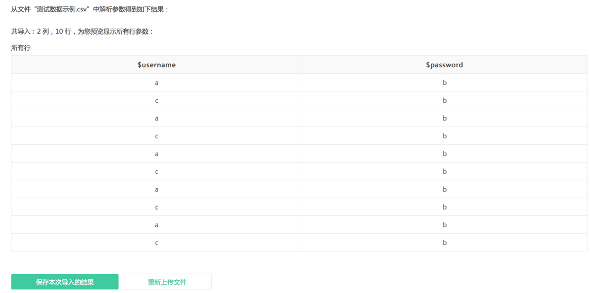
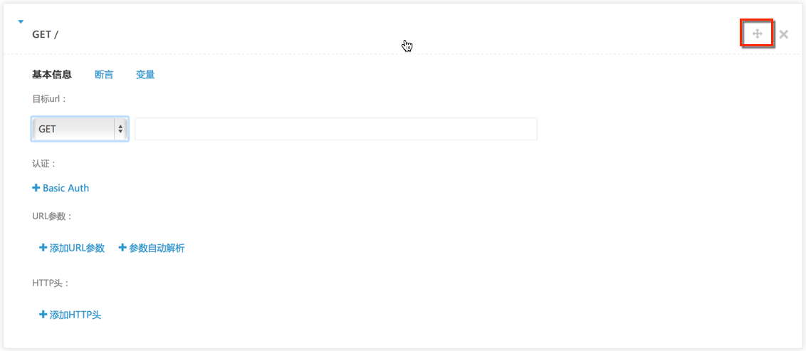
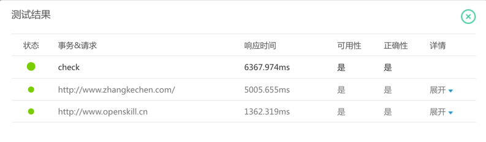
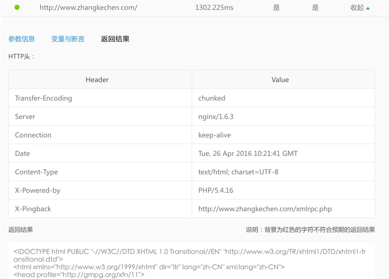

使用说明
======

创建测试数据
----------

在创建测试任务之前，首先需要准备测试数据。测试数据是指，执行测试任务时，为测试脚本准备的大量模拟数据，这些数据与脚本中的变量关联，能够在某个时段内产生尽量真实的测试结果。

创建测试数据时，您需要设置测试数据名称并上传数据文件。点击<上传文件>按钮选择数据文件，数据文件的格式要求说明如下：

* 支持的数据文件格式为CSV和ZIP，如果上传ZIP文件，则压缩包中只能包含1个CSV文件。CSV文件的编码格式最好为UTF-8，以免上传时出错。                                                                   
* 数据文件的大小必须小于60M。                                                                                                                   
* 数据文件中，列名对应测试脚本中的变量名，必须以“$”开始，可以由英文字母（a－z，A－Z）、阿拉伯数字（0-9）组成，例如“$Username”。此外，列名长度不能超过64个字符，且不能重复。

选择并上传数据文件后，压测宝会自动解析并展示数据文件中的参数，如下图所示。

创建测试脚本
----------

在创建测试任务之前，首先需要准备测试脚本。测试脚本，即Testing script，一般指一个特定测试的一系列指令，这些指令可以被自动化测试工具执行。为了提高测试脚本的可维护性和可复用性，必须在执行测试脚本之前对它们进行构建，测试脚本是自动执行测试过程（或部分测试过程）的计算机可读指令。

目前，压测宝主要提供面向移动互联网API后端接口的性能测试，一个测试脚本可以理解为一个事务，一个事务可以包含一个或一系列请求。

创建测试脚本时，需要设置测试脚本名称并进行事务管理。事务管理即为事务添加请求，各请求间可设置请求间隔。添加请求后，为保证测试脚本能在测试时正常执行，在保存测试脚本前还需验证脚本。

* `事务管理 <http://alina-docs.readthedocs.io/en/latest/Tutorials.html#id7>`_

* `验证脚本 <http://alina-docs.readthedocs.io/en/latest/Tutorials.html#id9>`_

* `设置初始化变量 <http://alina-docs.readthedocs.io/en/latest/Tutorials.html#id10>`_

* `JsonPath说明 <http://alina-docs.readthedocs.io/en/latest/Tutorials.html#id11>`_

* `XPath说明 <http://alina-docs.readthedocs.io/en/latest/Tutorials.html#id12>`_

事务管理
^^^^^^^

点击<添加新请求>按钮为事务添加请求，需要设置基本信息、断言和变量。

**基本信息**

在“基本信息”中，可以根据需要设置目标URL、认证、URL参数和HTTP头，详细说明见下表。

此处插入表格

**断言**

在“断言”中，可以为请求添加断言，添加断言后才能检查请求获取内容是否与预期内容相匹配，从而判断请求的正确性。

点击<添加断言>按钮添加断言，设置断言的属性名、比较条件和目标值，详细说明如下。

* 位置：目前支持的获取位置包括：JSON Body、XML Body、Text Body、Response Headers和状态码，例如选择“JSON Body”。

* 属性名：设置要检查的属性名，例如输入“id”。

* 比较条件：设置目标值与获取内容的比较条件，包括为空、不为空、等于、不等于、包含、不包含、是数字、数值等于、小于、小于等于、大于、大于等于等条件，例如选择“等于”。

* 目标值：设置判断获取内容是否正确的一个标准值，例如输入“1001”。

设置的断言的为：在JSON Body中，id的属性值等于1001。依此判断请求的正确性： JSON Body中，id的属性值等于1001时，请求正确性为“是”，否则为“否”。

**变量**

在“变量”中，可以设置动态提取变量，即动态地提取变量值并赋给初始化变量，有关初始化变量的设置方法请参考“`设置初始化变量 <http://alina-docs.readthedocs.io/en/latest/Tutorials.html#id10>`_”中的说明。

点击<提取变量值>按钮，设置变量获取位置、属性名并选择初始化变量。变量获取位置可以是Json Body、XML Body、Text Body、Response Headers、状态码。

**添加请求间隔**

一个事务中添加多个请求时，为控制请求的发送时间，可以在请求间添加请求间隔。

.. note::
   请求间隔指发起两个API请求的间隔时间，用于模拟真实的业务操作间的停顿时间，此时间内不对服务器产生压力。

点击<添加请求间隔>按钮添加请求间隔，选择间隔时间即可，目前支持1秒、2秒、3秒、5秒、10秒。例如选择“5”,则发送一条请求后，等待5秒后再发送下一条请求。

**调整请求或请求间隔的显示顺序**

将鼠标悬停在已添加的请求或请求间隔上，点击右上方的十字形图标并按住鼠标可将对应的请求或请求间隔移动到合适的位置，松开鼠标即可。

**删除请求或间隔**

将鼠标悬停在已添加的请求或请求间隔上，点击右上方的删除图标可删除请求或间隔。

验证脚本
^^^^^^^

添加请求后，为保证测试脚本能在测试时正常执行，需验证脚本。点击<验证脚本>按钮来测试事务的可用性和正确性并查看测试结果，如下图所示。

**测试结果说明**

测试结果中，第一行为整个事务的测试结果，下面为事务中每个请求的测试结果，包括响应时间、可用性和正确性。

根据可用性和正确性，测试结果分为以下三种状态：

* 绿色：事务或请求可用且正确

* 黄色：事务或请求可用但不正确

* 红色：事务或请求不可用

请求成功即可用，所有请求都可用时事务的可用性为“是”，否则为“否”。
添加断言时才能测试请求的正确性，所有请求的断言都正确时事务的正确性为“是”，否则为“否”。

**查看请求的测试结果详情**

点击<展开>按钮可以查看单个请求的测试结果详情，包括参数信息、变量与断言和返回结果。

返回结果中，背景为红色的字符是不符合预期的返回结果。

设置初始化变量
^^^^^^^^^^^^

JsonPath说明
^^^^^^^^^^^^

XPath说明
^^^^^^^^^

创建测试任务
----------

分析压测数据
----------

管理账号
-------

+------------+------------+-----------+------------+-----------+
|            |    Git     |    hg     |   bzr      |     svn   |
+============+============+===========+============+===========+
| Tags       |    Yes     |    Yes    |   Yes      |    No     |
+------------+------------+-----------+------------+-----------+
| Branches   |    Yes     |    Yes    |   Yes      |    No     |
+------------+------------+-----------+------------+-----------+
| Default    |    master  |   default |            |    trunk  |
+------------+------------+-----------+------------+-----------+

=====================  ========================  ============  =============
API                    Description               Request body  Response body
=====================  ========================  ============  =============
GET /api/todo          Get all to-do items       None          Array of to-do items
GET /api/todo/{id}     Get an item by ID         None          To-do item
POST /api/todo         Add a new item            To-do item    To-do item
PUT /api/todo/{id}     Update an existing item   To-do item    None
DELETE /api/todo/{id}  Delete an item.           None          None
=====================  ========================  ============  =============